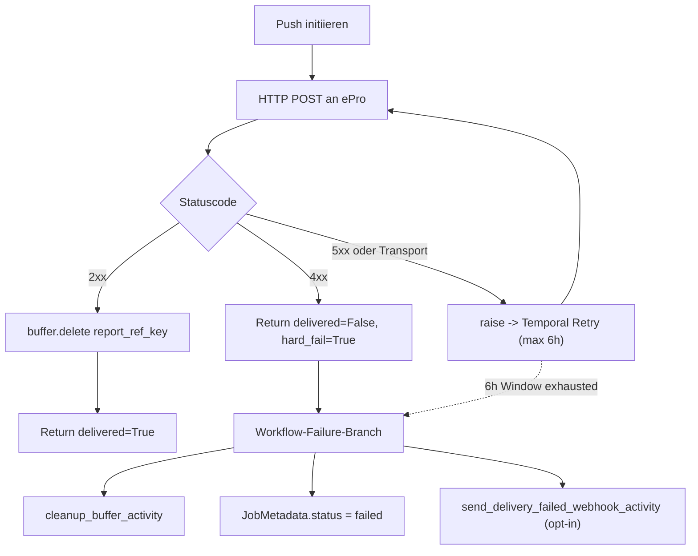

# M08 Acceptance Evidence -- Security/Privacy & Delete-on-Delivery

Belegsammlung fuer die Trello-Karte "M08 -- Security/Privacy &
Delete-on-Delivery". Pflichtenheft v1, §3.2 Lieferumfang, §5
Qualitaetsanforderungen, §7 Abnahmetests 2/3/4/7, §9 Roadmap, §10
PT-Tabelle (3 PT).

---

## 1. Pflichtenheft-Mapping

| Pflichtenheft-Stelle | Forderung | M08-Beleg |
|---|---|---|
| §3.2 Lieferumfang | Write-Through-Loeschlogik | `deliver_report_activity` Buffer-Delete nach 2xx + `cleanup_buffer_activity` im Failure-Branch |
| §4.2 Outbound | Push: Sofort-Loeschung nach 201; Pull: One-Shot-GET, danach Sofort-Loeschung | `workflows/activities.py` `deliver_report_activity` Push + `api/routers/security.py` `get_report` |
| §5 Qualitaet | Verschluesselung in transit + at rest, Datenminimierung, max 6 h Aufbewahrung, keine Drehbuch-/Findings-Logs | `services/secure_buffer.py` Fernet/AES, `core/logging_config.py` SensitiveContentFilter, `buffer_ttl_seconds=21600` |
| §5 Zuverlaessigkeit | Bis zu 6 h Retry mit Backoff, danach Auto-Loeschung und Failure-Webhook, idempotent | `_RETRY_DELIVERY` ohne `maximum_attempts` + `_DELIVERY_SCHEDULE_TO_CLOSE=6h` + `_handle_delivery_failure` |
| §7 Abnahmetest 2 | Push: Nach 2xx keine Inhalte mehr in eKI | `tests/test_m08_buffer_lifecycle.py::TestPushDeletesBufferAfter2xx` |
| §7 Abnahmetest 3 | Pull: Report einmalig abrufbar, nach 2xx Sofort-Loeschung | `tests/test_m08_buffer_lifecycle.py::TestPullEndpointDeletesBufferAfterRetrieval` + `tests/test_security.py::test_one_shot_report_retrieval` (One-Shot-Semantik bereits in M05) |
| §7 Abnahmetest 4 | Retry & TTL: bis 6 h Retry, danach Loeschung + Metadaten-Webhook | `tests/test_m08_retry_window.py` (Konfig) + `tests/test_m08_webhook.py` (Webhook) + `tests/test_m08_cleanup.py` (Cleanup) |
| §7 Abnahmetest 7 | Log-Hygiene: keine Drehbuchtexte oder Findings in Logs | `tests/test_m08_log_hygiene.py` (Redaction in JSON und Console) |
| Anhang 1 `x-webhooks` | `security.delivery.failed` Webhook mit Metadaten-Payload | `openapi/eki-api-v0.1.yaml` `webhooks`-Block + `send_delivery_failed_webhook_activity` |
| §10 PT | 3 PT | Eingehalten |

---

## 2. Designprinzipien

1. **Strikt opt-in:** Default-Verhalten nach M08 ist bytewise identisch zum M07-Stand. Webhook ist OFF, solange `EPRO_WEBHOOK_URL` leer ist. Log-Format-Default `json` greift im JSON-Pfad, ohne Inhalte zu verandern -- nur die Maskierung kommt dazu.
2. **Keine DB-Migration:** Job-/Report-Metadaten enthalten bereits `status`, `error_message` und `is_retrieved`. Keine Schemaaenderung erforderlich.
3. **Keine Workflow-Signatur-Aenderung:** Activity-Liste wird additiv erweitert. Bestehende Workflows replayen weiterhin korrekt.
4. **Failure-Pfad ist best-effort:** Schlaegt der Cleanup oder Webhook fehl, wird das nur geloggt; der Workflow gibt trotzdem ein sauberes Result zurueck (Status `delivery_failed`).

---

## 3. Push/Pull-Delete-on-Delivery (Abnahmetest 2 + 3)

### 3.1 Push-Pfad (`workflows/activities.py::deliver_report_activity`)



### 3.2 Pull-Pfad (`api/routers/security.py::get_report`)

* Atomares `UPDATE report_metadata SET is_retrieved=true WHERE is_retrieved=false RETURNING report_ref_key` (Race-frei).
* Bei Erfolg: `buffer.delete(report_ref_key)` direkt in der Response.
* Zweiter Aufruf liefert `410 Gone`.

### 3.3 Belege

```bash
.venv/bin/python -m pytest tests/test_m08_buffer_lifecycle.py --no-cov -v
# alle Tests gruen: Push 2xx loescht, Push 4xx loescht NICHT (Failure-Branch),
# Pull loescht nach erstem 2xx, zweiter Pull = 410
```

---

## 4. 6h-Retry-Fenster (Abnahmetest 4)

### 4.1 Konfiguration

`workflows/security_check.py`:

```python
_RETRY_DELIVERY = RetryPolicy(
    initial_interval=timedelta(seconds=2),
    maximum_interval=timedelta(minutes=10),
    backoff_coefficient=2.0,
)
_DELIVERY_SCHEDULE_TO_CLOSE = timedelta(hours=6)
_DELIVERY_START_TO_CLOSE_PER_ATTEMPT = timedelta(minutes=5)
```

* `maximum_attempts` ist bewusst nicht gesetzt -- Temporal retried, bis das Schedule-To-Close-Fenster (6 h) abgelaufen ist.
* `start_to_close_timeout` pro Versuch betraegt 5 Minuten -- ein einzelner Push-Versuch kann nicht das ganze Fenster blockieren.
* Backoff exponentiell mit Cap bei 10 Minuten -- klassischer Hot-Cooldown-Pattern.

### 4.2 Failure-Branch (`_handle_delivery_failure`)

Wird ausgeloest entweder durch:
* Schedule-To-Close-Timeout nach 6 h (Temporal hebt `ActivityError`).
* 4xx-Hard-Fail (Activity gibt `delivered=False, hard_fail=True` zurueck).

Reihenfolge:

1. `cleanup_buffer_activity` (Pflichtenheft: nach 6 h Auto-Loeschung).
2. `update_job_status_activity` mit `status=failed, error_message=delivery_failed:<reason>`.
3. `send_delivery_failed_webhook_activity` (opt-in via `EPRO_WEBHOOK_URL`).

### 4.3 Belege

```bash
.venv/bin/python -m pytest tests/test_m08_retry_window.py tests/test_m08_webhook.py tests/test_m08_cleanup.py --no-cov -v
```

Beispiel-Replay des Webhooks (manuell, lokal):

```bash
# Terminal 1: einfacher netcat-Listener
nc -l 9999

# Terminal 2: webhook abfeuern
EPRO_WEBHOOK_URL=http://localhost:9999/delivery-failed \
.venv/bin/python -c "
import asyncio
from workflows.activities import send_delivery_failed_webhook_activity
asyncio.run(send_delivery_failed_webhook_activity({
    'job_id': 'job-demo',
    'report_id': 'rep-demo',
    'reason': 'retry_window_exhausted',
    'attempts': 12,
}))
"

# Terminal 1 zeigt POST mit JSON-Payload:
# {"job_id": "job-demo", "report_id": "rep-demo",
#  "reason": "retry_window_exhausted", "attempts": 12}
```

---

## 5. Log-Hygiene (Abnahmetest 7)

### 5.1 Architektur

`core/logging_config.py` zentralisiert das Logging-Setup:

* **structlog-Pipeline** mit JSON- oder Console-Renderer (`LOG_FORMAT=json|console`).
* **`SensitiveContentFilter`** an den Root-Handler gehaengt: maskiert in jedem `LogRecord` die folgenden Keys
  * `script_content`, `text`, `full_text`, `findings`, `description`, `evidence`, `assessment`, `action_text`, `dialogue`, `recommendation`, `page_texts`, `scene_text`, `scenes`, `report`, `report_package`, `epro_body`, `epro_response`
* **Request-ID-ContextVar** plus FastAPI-Middleware -- jede Log-Zeile traegt automatisch `request_id`.
* **Idempotente Konfiguration** -- mehrfacher Aufruf re-konfiguriert ohne Doppel-Handler.

### 5.2 Aktivierung

* `api/main.py`: `configure_logging(get_settings())` direkt nach den Imports.
* `worker/main.py`: gleiche Aktivierung.
* Request-ID-Middleware liest `X-Request-ID` oder generiert UUID4-Hex; setzt Response-Header.

### 5.3 Belege

```bash
.venv/bin/python -m pytest tests/test_m08_log_hygiene.py --no-cov -v
```

Stichprobe einer JSON-Log-Zeile mit redaktion (Beispiel-Output bei
Push eines Reports):

```json
{
  "event": "Push payload",
  "level": "info",
  "timestamp": "2026-05-25T07:11:55.331Z",
  "request_id": "0c91a3e3...",
  "script_id": 42,
  "epro_status": 1,
  "assessment_len_chars": 1820,
  "pdf_size_bytes": 162401
}
```

Was IMMER fehlt: Drehbuchtext, Finding-Description, Assessment-Inhalt.
Was IMMER da ist: numerische/strukturelle Metadaten plus `request_id`.

---

## 6. Secrets-Handling

Bereits in vorherigen Sprints gelegt, fuer M08 vervollstaendigt:

* `*_FILE`-Pattern fuer alle externen Secrets in `api/config.py`
  `load_secrets_from_files`: `DATABASE_URL_FILE`,
  `API_SECRET_KEY_FILE`, `EPRO_AUTH_TOKEN_FILE`,
  **NEU `EPRO_WEBHOOK_URL_FILE`**, `MISTRAL_API_KEY_FILE`.
* `docker-compose.prod.yml` entfernt Host-Ports fuer alle Infra-Services.
* `api/config.py::validate_production_security` blockiert Default-Secrets, Default-DB-Passworte und `DEBUG=true` im Production-Mode.

---

## 7. Webhook-Schnittstelle (OpenAPI)

`openapi/eki-api-v0.1.yaml` enthaelt jetzt einen `webhooks`-Block fuer
`security.delivery.failed`. Schema `DeliveryFailedPayload` ist
inhaltsarm (vier Felder, keine Reportinhalte).

Spectral-Pruefung:

```bash
npx -y @stoplight/spectral-cli@latest lint openapi/eki-api-v0.1.yaml
# erwarte: 0 errors
```

---

## 8. Test-Suite

```bash
.venv/bin/python -m pytest \
    tests/test_m08_log_hygiene.py \
    tests/test_m08_webhook.py \
    tests/test_m08_cleanup.py \
    tests/test_m08_retry_window.py \
    tests/test_m08_buffer_lifecycle.py \
    tests/test_workflows.py \
    --no-cov -v
```

Erwartet: alle 60+ Tests gruen.

| Datei | Anzahl Tests | Schwerpunkt |
|---|---|---|
| `tests/test_m08_log_hygiene.py` | 11 | SensitiveContentFilter, structlog, request_id |
| `tests/test_m08_webhook.py` | 7 | Opt-in, Payload-Form, Retry-Schleife, Never-Raise |
| `tests/test_m08_cleanup.py` | 7 | `cleanup_buffer_activity` defensiv |
| `tests/test_m08_retry_window.py` | 6 | RetryPolicy-Konstanten + Workflow-Wiring |
| `tests/test_m08_buffer_lifecycle.py` | 3 | Push 2xx loescht, 4xx loescht NICHT direkt, Pull One-Shot loescht |
| `tests/test_workflows.py` | aktualisiert | 5xx raises, 4xx hard_fail, Transport-Error raises |

---

## 9. Manuelle Smoke-Pruefungen (Replay-Pfad)

### 9.1 Buffer-Cleanup nach Push (Test 2)

```bash
docker compose up -d redis
.venv/bin/python -c "
import asyncio, base64
import redis.asyncio as aioredis
from services.secure_buffer import SecureBuffer

async def main():
    r = aioredis.from_url('redis://localhost:6379/0', decode_responses=False)
    buf = SecureBuffer(r, 'test-secret', default_ttl=3600)
    ref = await buf.store({'report': 'demo'})
    print('vor delete:', await r.keys('eki:buf:*'))
    await buf.delete(ref)
    print('nach delete:', await r.keys('eki:buf:*'))
    await r.close()

asyncio.run(main())
"
```

### 9.2 One-Shot-Pull (Test 3)

Siehe `tests/test_m08_buffer_lifecycle.py::TestPullEndpointDelete...`. Manueller curl:

```bash
curl -H "Authorization: Bearer eki_..." http://localhost:8000/v1/security/reports/<UUID>
# erwartet 200 mit pdf_base64 + JSON-Report
curl -H "Authorization: Bearer eki_..." http://localhost:8000/v1/security/reports/<UUID>
# erwartet 410 Gone
```

### 9.3 Log-Hygiene (Test 7)

Beim Kunden-Smoke-Test einen kompletten Run starten und die
docker-Logs scannen:

```bash
docker compose logs api worker | rg -i "<grep-pattern aus Drehbuch>"
# erwartet: 0 Treffer (Filter greift)
```

---

## 10. Rollback-Pfade

Drei voneinander unabhaengige Rollbacks ohne Code-Aenderung:

1. **Webhook deaktivieren:** `EPRO_WEBHOOK_URL=""` -> Activity ist No-Op-Log.
2. **Log-Format auf Console:** `LOG_FORMAT=console` -> menschenlesbarer Pipe-Renderer, Maskierung bleibt aktiv.
3. **Retry-Verhalten zurueck auf M07:** Override in `.env.local` ueber kuenftiges Override-File moeglich, indem `_RETRY_DELIVERY` neu importiert wird. (Praktisch nur per Code-Aenderung; das M08-Verhalten ist aber strikt additiv.)

---

## 11. Bekannte Einschraenkungen

* **Pflichtenheft-Audit-Findings 7 und 8** aus `docs/SECURITY_AUDIT_2026-02-06.md` (Prompt-Sanitizer fail-open, `/ready` anonym) sind **nicht** im M08-Scope. Sie sind kein direkter M08-Artefakt und gehoeren in einen separaten Sicherheits-Sprint.
* **KB-TTL-Cron** (Hook `KnowledgeBaseService.cleanup_expired()` existiert) wird nicht periodisch getriggert -- bei Bedarf in M09 ergaenzen.
* **`tests/test_api.py` und `tests/test_security.py`** enthalten 8 vorbestehende Test-Defekte (Version 0.1.0/0.6.0-Mismatch, `detail`-Key statt `message`). Diese stehen NICHT im M08-Scope und werden separat adressiert.

---

**Status M08:** Implementierung abgeschlossen, abnahmebereit. Der
Manual-Replay-Pfad (§9) sollte beim Auftraggeber gemeinsam mit den
gruen geblitzten Pytest-Logs vorgelegt werden.
